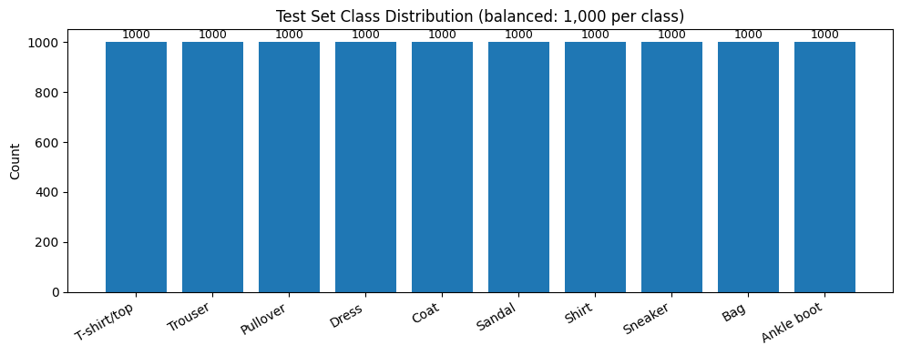
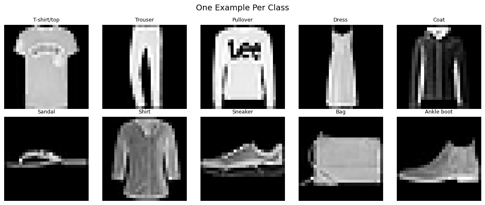
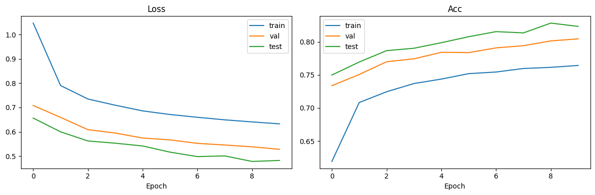
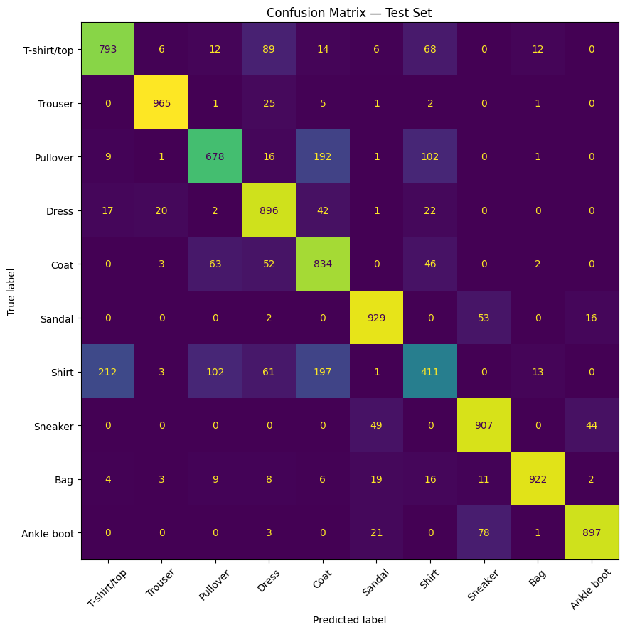
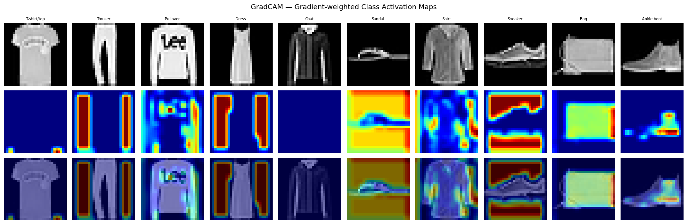
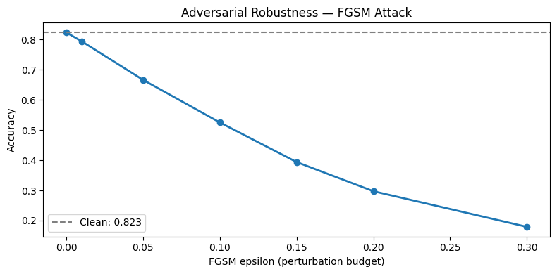
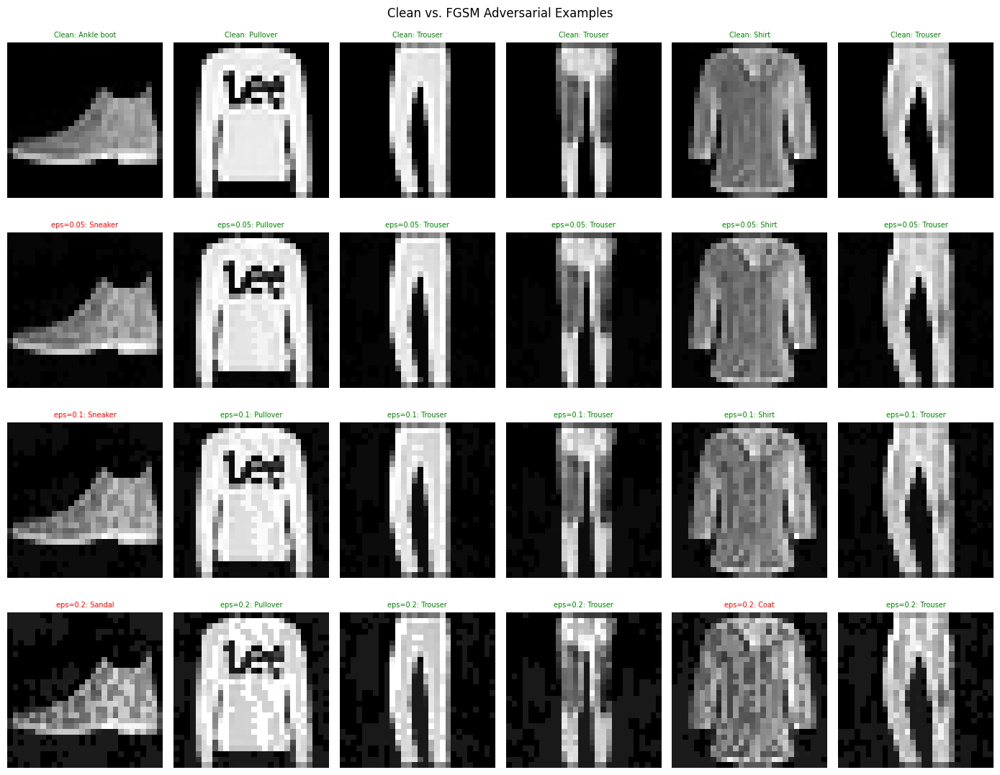
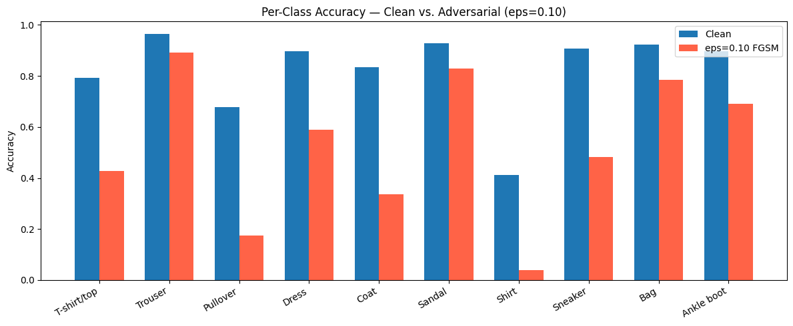

# Fashion MNIST — CNN with Adversarial Robustness Analysis

A PyTorch CNN trained on Fashion MNIST, extended with **GradCAM explainability** and **FGSM adversarial robustness analysis** to identify which garment classes are most exploitable at the pixel level.

---

## Dataset





10 balanced classes (1,000 test samples each). The dataset is perfectly balanced, so per-class F1 is the right metric — accuracy alone hides the Shirt problem.

---

## Training



| Split | Accuracy |
|-------|----------|
| Train | 76.4%    |
| Val   | 80.4%    |
| Test  | 82.3%    |

---

## Evaluation



The Shirt↔Pullover↔Coat cluster dominates misclassifications — these three classes share similar silhouettes and textures, making them the weak points of the model.

**Per-class F1:**

| Class        | Precision | Recall | F1   |
|--------------|-----------|--------|------|
| Trouser      | 0.96      | 0.96   | 0.96 |
| Bag          | 0.97      | 0.92   | 0.94 |
| Sandal       | 0.90      | 0.93   | 0.92 |
| Ankle boot   | 0.94      | 0.90   | 0.92 |
| Sneaker      | 0.86      | 0.91   | 0.89 |
| Dress        | 0.78      | 0.90   | 0.83 |
| T-shirt/top  | 0.77      | 0.79   | 0.78 |
| Pullover     | 0.78      | 0.68   | 0.73 |
| Coat         | 0.65      | 0.83   | 0.73 |
| **Shirt**    | 0.62      | 0.41   | **0.49** |

---

## Explainability — GradCAM



Gradient-weighted Class Activation Maps show which pixels drive each prediction. Ankle boots activate on the sole/heel; bags on the rectangular outline; sneakers on the toe and sole ridge. Shirts scatter activation diffusely — no stable discriminative region — which is why they're the most adversarially exploitable class.

---

## Adversarial Robustness — FGSM

FGSM finds the smallest pixel perturbation along the loss gradient that flips the prediction:

$$x_{\text{adv}} = x + \varepsilon \cdot \text{sign}(\nabla_x \mathcal{L}(f(x), y))$$

### Accuracy vs. perturbation budget



| ε    | Accuracy | Drop  |
|------|----------|-------|
| 0.00 | 82.3%    | —     |
| 0.01 | 79.4%    | 2.9%  |
| 0.05 | 66.6%    | 15.7% |
| 0.10 | 52.5%    | 29.8% |
| 0.20 | 29.7%    | 52.6% |
| 0.30 | 17.9%    | 64.4% |

### What adversarial examples look like



At ε=0.05 the perturbation is imperceptible to the eye but already drops accuracy by 15 points. By ε=0.20 the images look subtly noisy but the model is down to 30%.

### Per-class vulnerability



| Class       | Clean | ε=0.10 | Drop  |
|-------------|-------|--------|-------|
| Pullover    | 67.8% | 17.5%  | 50.3% |
| Coat        | 83.4% | 33.7%  | 49.7% |
| Sneaker     | 90.7% | 48.3%  | 42.4% |
| Shirt       | 41.1% | 4.0%   | 37.1% |
| T-shirt/top | 79.3% | 42.8%  | 36.5% |
| Trouser     | 96.5% | 89.2%  | 7.3%  |

**Shirt is the most adversarially exploitable class** — clean accuracy is already only 41%, and ε=0.10 collapses it to 4%. Its decision boundary overlaps Pullover, Coat, and T-shirt/top simultaneously, so any gradient step finds a neighboring class almost instantly. Trouser, Bag, and Sandal are the most robust because their silhouettes are geometrically distinct.

---

## Stack

- Python 3 · PyTorch · TorchVision
- scikit-learn (metrics, confusion matrix)
- Matplotlib

## How to Run

```bash
pip install torch torchvision scikit-learn matplotlib
jupyter notebook FashionMNIST.ipynb
```

Dataset downloads automatically (~30 MB). Training takes ~3 minutes on CPU, ~30 seconds on GPU.
